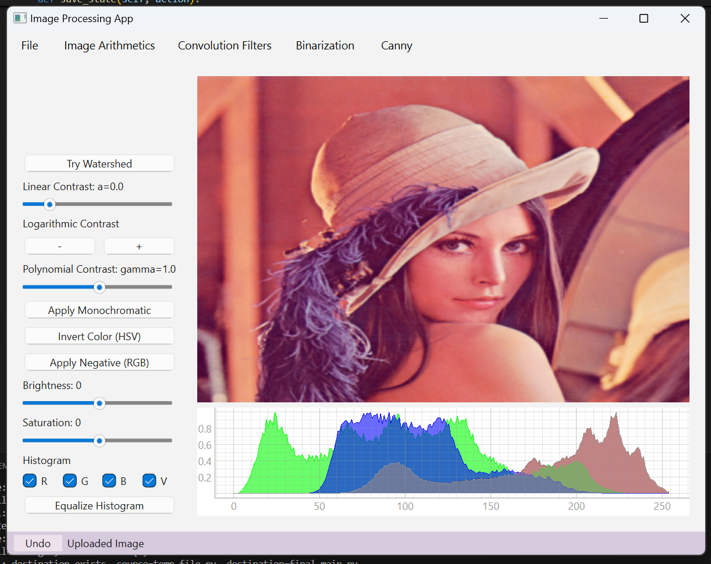
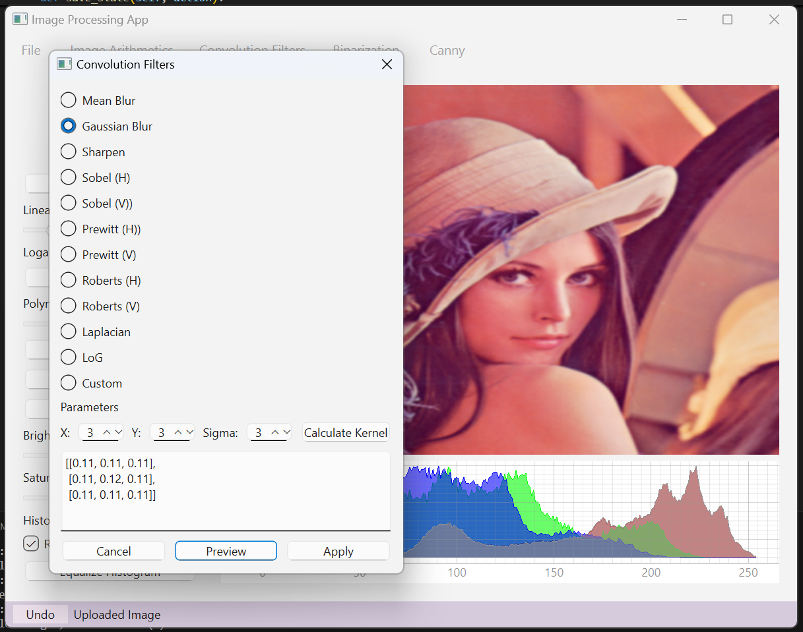
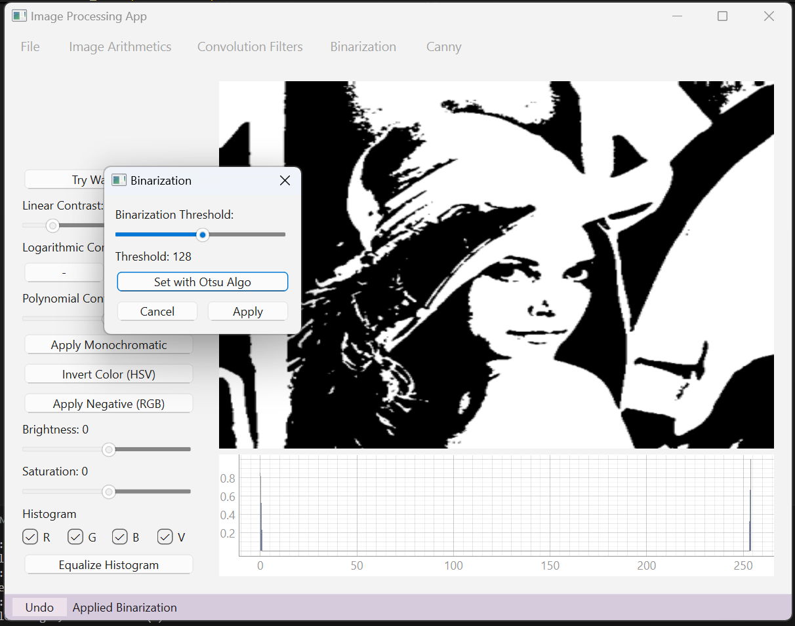
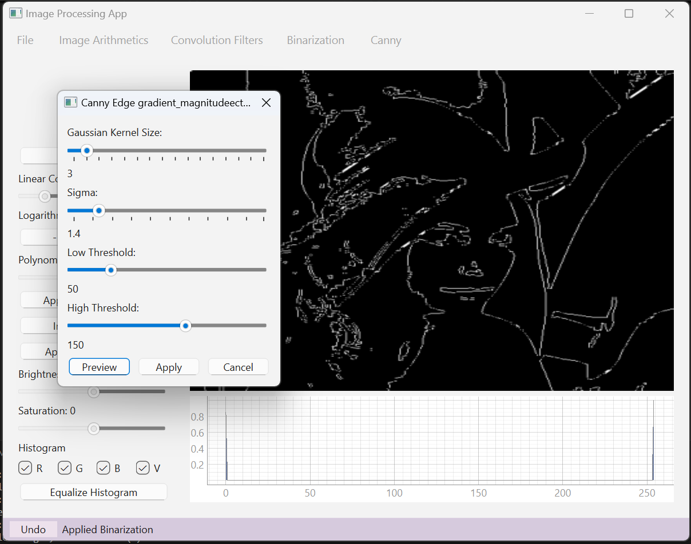

# Image Processing Application

This PyQt6-based application provides a comprehensive set of image processing tools and filters.

## Features

- Image loading and saving
- Brightness and saturation adjustments
- Contrast adjustments (linear, logarithmic, exponential)
- Color manipulations:
  - Monochromatic effect
  - Color inversion (HSV)
  - Negative effect (RGB)
- Histogram visualization and equalization
- Convolution filters:
  - Mean blur
  - Gaussian blur
  - Sharpening
  - Sobel edge detection
  - Prewitt edge detection
  - Roberts edge detection
  - Laplacian edge detection
- Canny edge detection
- Image binarization with Otsu's method
- Watershed segmentation algorithm
- Image arithmetic operations:
  - Addition
  - Subtraction
  - Product
- Undo functionality for all operations

## Screenshots

Here are some sample screenshots of the application in action:

## Requirements

- Python 3.x
- PyQt6
- NumPy
- Pillow
- PyQtGraph
- SciPy
- OpenCV

## Usage

Run the `final_main.py` script to start the application. Use the menu options and sliders to apply various image processing operations.